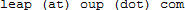

# How to use the LEAP SPARQL endpoint
In OUP dictionaries we are moving towards using RDF to manage our language data. This allows us to connect our highly-curated but previously isolated datasets, making explicit the richness of our data while taking advantage of everything linked data has to offer on the wider semantic web. This endpoint allows access to a subset of our data with SPARQL queries. The subset consists of a British English dictionary; full English morphology; bilingual senses from isiZulu-English, English-isiZulu, Northern Sotho-English, & English-Northern Sotho; partial morphologies of isiZulu & Northern Sotho; and finally, a restructured version of WordNet 3.0.

## Access
The endpoint is not (yet) public. If you would like access, please send us an email to .

## SPARQL Specification
SPARQL is a W3C standard and the spec can be found at: http://www.w3.org/TR/sparql11-query/

## SPARQL Queries

### Generic query
To be able to identify the elements within the repository, you can start by:

    select  * where {
        ?s ?p ?o.
    } limit 100

This query will provide a sample of 100 triples within the repository. These triples may include some data and a portion of the data model. The result will look similar to the following image:

By clicking on a link, for example (http://languagehub.oup.com/aardwolf) IRI, you will be redirected to a page similar to the following image:

This result page displays all the information about this specific IRI, along with the context associated to each triple. The context is basically the graph name that this triple belongs to. If the context is empty, the triple exists in the default graph.

Note: In the previous image, you can easily explore the subject, the predicate, the object, or all of the information by clicking on the appropriate tab. Since the repository contains an inference engine, by selecting various inferencing options, you can individually view the explicit, and implicit triples, or view them collectively.

### Extracting headwords and their type
Every headword in the repository has a type assigned to it that could be any of `UpperOntology:Word`, `UpperOntology:Phrase`, or `UpperOntology:PartOfWord`.

    PREFIX UpperOntology: <http://languagehub.oup.com/UpperOntology/>
    select * where {
        ?word a UpperOntology:Form.
        ?word a ?type.
        filter( ?type in (UpperOntology:Word, UpperOntology:Phrase, UpperOntology:PartOfWord))
    } limit 100

### Extracting the lexical entry
To discover the senses of a headword, we must first extract the lexical entry. The lexical entry will provide language, and lexical category:

    PREFIX : <http://languagehub.oup.com/>
    PREFIX UpperOntology: <http://languagehub.oup.com/UpperOntology/>
	PREFIX rdfs: <http://www.w3.org/2000/01/rdf-schema#>
	select distinct ?word ?label ?lexicalEntry where {
	    ?word a UpperOntology:Form.
	    ?word rdfs:label ?l.
	    ?word UpperOntology:isLexicalFormOf ?lexicalEntry.
	    bind (str(?l) as ?label )
	    filter(?word= :book)
	} 
	
#### Extracting the language and the lexical category of a lexical entry	
Since there are various labels, some with languages assigned, we can bind the label without the language to a new variable. As you can see, `book` has multiple lexical categories. We can extract language, and lexical category. 
    
    PREFIX : <http://languagehub.oup.com/>
	PREFIX UpperOntology: <http://languagehub.oup.com/UpperOntology/>
	PREFIX rdfs: <http://www.w3.org/2000/01/rdf-schema#>
	select distinct ?word ?label ?lang ?lexCat where {
	    ?word a UpperOntology:Form.
	    ?word rdfs:label ?l.
	    ?word UpperOntology:isLexicalFormOf ?lexicalEntry.
	    ?lexicalEntry UpperOntology:hasLanguage ?lang.
	    ?lexicalEntry UpperOntology:hasLexicalCategory ?lexCat.
	    bind (str(?l) as ?label )
	    filter(?word= :book)
	}
	
#### Extracting the inflections of a lexical entry
If a headword contains inflections, they are attached to the lexical entry:

	PREFIX : <http://languagehub.oup.com/>
	PREFIX UpperOntology: <http://languagehub.oup.com/UpperOntology/>
	select distinct ?inflection where {
	    ?word a UpperOntology:Form.
	    ?word UpperOntology:isLexicalFormOf ?lexicalEntry.
	    ?lexicalEntry UpperOntology:hasLexicalCategory UpperOntology:Noun.
	    ?lexicalEntry UpperOntology:hasSense ?sense.
	    ?lexicalEntry UpperOntology:hasInflection ?inflection.
	
	    filter(?word= :book)
	} 
	
#### Extracting the pronunciation of a lexical entry
Pronunciation is also attached to the lexical entry, and provides information about the phonetic spelling and the phonetic notation.

	PREFIX : <http://languagehub.oup.com/>
	PREFIX UpperOntology: <http://languagehub.oup.com/UpperOntology/>
	select distinct * where {
	    ?word a UpperOntology:Form.
	    ?word UpperOntology:isLexicalFormOf ?lexicalEntry.
	    ?lexicalEntry UpperOntology:hasPronunciationID ?pronunciationID.
	    ?pronunciationID UpperOntology:hasPhoneticsNotation ?phonetic_notation.
	    ?pronunciationID UpperOntology:hasPhoneticSpelling ?phonetic_spelling.
	
	    filter(?word= :book)
	} 	
	
#### Extracting domain information
Domain information is a context and can be used for disambiguation.

	PREFIX : <http://languagehub.oup.com/>
	PREFIX UpperOntology: <http://languagehub.oup.com/UpperOntology/>
	select distinct *  where {
	    ?word a UpperOntology:Form.
	    ?word UpperOntology:isLexicalFormOf ?lexicalEntry.
	    ?lexicalEntry UpperOntology:hasLexicalCategory UpperOntology:Noun.
	    ?lexicalEntry UpperOntology:hasSense ?sense.
	    ?sense UpperOntology:hasDomain ?domain.
	
	    filter(?word= :book)
	} 
    
### Extracting senses of a headword
The sense of a headword can provide more detailed information. For example, region (e.g. GB, US, ...), definition, simple definition (extracted from a bilingual dictionary), translation, example, etc. Some of these properties might be empty, due to insufficient data, or not being applicable (e.g. senses might not have region).

    	PREFIX : <http://languagehub.oup.com/>
	PREFIX UpperOntology: <http://languagehub.oup.com/UpperOntology/>
	PREFIX rdfs: <http://www.w3.org/2000/01/rdf-schema#>
	select distinct ?word ?label ?region where {
	    ?word a UpperOntology:Form.
	    ?word rdfs:label ?l.
	    ?word UpperOntology:isLexicalFormOf ?lexicalEntry.
	    ?lexicalEntry UpperOntology:hasSense ?sense.
	    optional{
	        ?sense UpperOntology:hasRegion ?region.
	    }
	
	    bind (str(?l) as ?label )
	    filter(?word= :book)
	}  

#### Extracting primary sense

If you just are looking for the primary sense:

	PREFIX : <http://languagehub.oup.com/>
	PREFIX UpperOntology: <http://languagehub.oup.com/UpperOntology/>
	select distinct *  where {
	    ?word a UpperOntology:Form.
	    ?word UpperOntology:isLexicalFormOf ?lexicalEntry.
	    ?lexicalEntry UpperOntology:hasLexicalCategory UpperOntology:Noun.
	    ?lexicalEntry UpperOntology:hasPrimarySense ?sense.
	
	    filter(?word= :book)
	} 

There must be only one primary sense for each lexical entry. If more than one primary sense is observed, it has been generated from different dictionaries.

#### Extracting register
Register specifies the social setting in which a headword can be used.

	PREFIX : <http://languagehub.oup.com/>
	PREFIX UpperOntology: <http://languagehub.oup.com/UpperOntology/>
	select distinct *  where {
	    ?word a UpperOntology:Form.
	    ?word UpperOntology:isLexicalFormOf ?lexicalEntry.
	    ?lexicalEntry UpperOntology:hasLexicalCategory UpperOntology:Noun.
	    ?lexicalEntry UpperOntology:hasSense ?sense.
	    ?sense UpperOntology:hasRegister ?register.
	
	    filter(?word= :dad)
	} limit 100
 

#### Sense definitions and examples
The following query shows the various definitions of `book`, and examples for these definitions, or simply examples of the headword.

    PREFIX : <http://languagehub.oup.com/>
	PREFIX UpperOntology: <http://languagehub.oup.com/UpperOntology/>
	select distinct ?word ?definition ?example  where {
	    ?word a UpperOntology:Form.
	    ?word UpperOntology:isLexicalFormOf ?lexicalEntry.
	    ?lexicalEntry UpperOntology:hasSense ?sense.
	    optional{
	        ?sense UpperOntology:hasDefinition ?definition.
	    }
	    optional{
	        ?sense UpperOntology:hasExample ?example.
	    }

	    filter(?word= :book)
	} 

#### Sense translations 
We can extract translations of a specific word in as many languages as the data provides. The following example demonstrates the various translations of `book` with lexical category `noun`. The following query should retrieve translations in `isiZulu` and `Northern Sotho`.

	PREFIX : <http://languagehub.oup.com/>
	PREFIX UpperOntology: <http://languagehub.oup.com/UpperOntology/>
	select distinct * where {
	    ?word a UpperOntology:Form.
	    ?word UpperOntology:isLexicalFormOf ?lexicalEntry.
	    ?lexicalEntry UpperOntology:hasLexicalCategory UpperOntology:Noun.
	    ?lexicalEntry UpperOntology:hasSense ?sense.
	    ?sense UpperOntology:hasTranslation ?translation.
	    ?translation UpperOntology:hasLanguage ?target_lang.
	
	    filter(?word= :book)
	} 
	
#### Related headwords to the sense
The endpoint is able to display related terms to a specified headword. For example, `back` with lexical category `verb`, has a related term `veer`.

	PREFIX : <http://languagehub.oup.com/>
	PREFIX UpperOntology: <http://languagehub.oup.com/UpperOntology/>
	select distinct ?word ?related_words where {
	    ?word a UpperOntology:Form.
	    ?word UpperOntology:isLexicalFormOf ?lexicalEntry.
	    ?lexicalEntry UpperOntology:hasLexicalCategory UpperOntology:verb.
	    ?lexicalEntry UpperOntology:hasSense ?sense.
	    ?sense UpperOntology:isRelatedTo ?related_words.
	
	    filter(?word= :back)
	}  limit 100

### Extracting etymology of a headword

Some headwords may contain information about the root of the word, the date of origin, and/or the language of origin.

	PREFIX : <http://languagehub.oup.com/>
	PREFIX UpperOntology: <http://languagehub.oup.com/UpperOntology/>
	select distinct * where {
	    ?word a UpperOntology:Form.
	    ?word UpperOntology:isLexicalFormOf ?lexicalEntry.
	    ?lexicalEntry UpperOntology:hasLexicalCategory UpperOntology:Verb.
	    ?lexicalEntry UpperOntology:hasEtymology ?etymology.
	    optional{
	        ?lexicalEntry UpperOntology:hasDateOfOrigin ?date_origin.
	    }
	    optional{
	        ?lexicalEntry UpperOntology:hasLanguageOfOrigin ?lang_origin.
	    }
	
	    filter(?word= :book)
	}  limit 100

#### Extracting translations across languages
We can easily get a translation of a word by examining the sense of a specified word. For example, `ibhuku` in isiZulu means `book` in English.

	PREFIX : <http://languagehub.oup.com/>
	PREFIX UpperOntology: <http://languagehub.oup.com/UpperOntology/>
	select distinct * where {
	    ?word a UpperOntology:Form.
	    ?word UpperOntology:isLexicalFormOf ?lexicalEntry.
	    ?lexicalEntry UpperOntology:hasLexicalCategory UpperOntology:noun.
	    ?lexicalEntry UpperOntology:hasSense ?sense.
	    ?sense UpperOntology:hasTranslation ?translation.
        ?translation UpperOntology:hasLanguage ?target_lang.
	
	    filter(?word= :ibhuku)
	}  limit 100
	
We can go a step forward and examine the translation (in the following example `?translation`), and see if we can extract translations between two languages for which don't have a bilingual dictionary. The following query will takes the isiZulu `ibhuku`, finds the translation in English (`book`), and from there finds the translation into Northern Sotho.

	PREFIX : <http://languagehub.oup.com/>
	PREFIX UpperOntology: <http://languagehub.oup.com/UpperOntology/>
	select distinct * where {
	    ?word a UpperOntology:Form.
	    ?word UpperOntology:isLexicalFormOf ?lexicalEntry.
	    ?lexicalEntry UpperOntology:hasLexicalCategory UpperOntology:noun.
	    ?lexicalEntry UpperOntology:hasLanguage ?s_lang.
	    ?lexicalEntry UpperOntology:hasSense ?sense.
	    ?sense UpperOntology:hasTranslation ?translation1.
	    ?translation1 UpperOntology:isTranslationOf ?t_sense.
	    ?lexicalEntry2 UpperOntology:hasSense ?t_sense.
	    ?lexicalEntry2 UpperOntology:hasCanonicalForm ?can_form.
	    ?lexicalEntry2 UpperOntology:hasLexicalCategory UpperOntology:noun.
	    ?lexicalEntry2 UpperOntology:hasLanguage ?target_lang.
	
	    filter((?word= :ibhuku) && (?s_lang != ?target_lang) )
	}
	

### Extracting hypernyms, hyponyms, ... 

The form in this model, can provide information regarding hypernym, hyponym, antonym, Holonym, and etc. A sample query for extracting such properties is:

	PREFIX : <http://languagehub.oup.com/>
	PREFIX UpperOntology: <http://languagehub.oup.com/UpperOntology/>
	select *  where {
	    ?word a UpperOntology:Form.
	    ?word UpperOntology:hasAntonym ?antonym.
	
	    filter(?word= :better)
	} limit 100
	
An example for extracting entailments: 

	PREFIX : <http://languagehub.oup.com/>
	PREFIX UpperOntology: <http://languagehub.oup.com/UpperOntology/>
	select *  where {
	    ?word a UpperOntology:Form.
	    ?word UpperOntology:hasEntailment ?entail.
	
	    filter(?word= :look)
	} limit 100
	
### Extracting inflected forms
Lexical Entry might provide information regarding the inflected forms of a headword:

	PREFIX : <http://languagehub.oup.com/>
	PREFIX UpperOntology: <http://languagehub.oup.com/UpperOntology/>
	select * where {
	    ?word a UpperOntology:Form.
	    ?word UpperOntology:isLexicalFormOf ?lexicalEntry.
	    ?lexicalEntry UpperOntology:hasInflection ?inflection.

	    filter(?word= :run)
	}  limit 100

### Extracting (limited) syntactic information
There is a limited amount of syntactic information regarding senses of headwords:

	PREFIX : <http://languagehub.oup.com/>
	PREFIX UpperOntology: <http://languagehub.oup.com/UpperOntology/>
	select * where {
	    ?word a UpperOntology:Form.
	    optional{
	        ?word UpperOntology:hasPerson ?person.
	    }
	    optional{
	        ?word UpperOntology:hasTense ?tense.
	    }
	    optional{
	        ?word UpperOntology:hasNumber ?number.
	    }
	
	}  limit 100
	
### Extracting cross dictionary hypernyms

The current endpoint only contains hypernym information about English. Since we have bilingual dictionaries as well, we can extract information regarding hypernyms in target languages. However, as you can see below, this information is not always accurate. We are working towards adding more information to be able to disambiguate these results.

	PREFIX : <http://languagehub.oup.com/>
	PREFIX UpperOntology: <http://languagehub.oup.com/UpperOntology/>
	PREFIX rdfs: <http://www.w3.org/2000/01/rdf-schema#>
	select distinct (str(?label) as ?hyper) (group_concat(distinct ?t_label ; separator = " -- ") AS ?hypo) 		where {
	    ?word a UpperOntology:Form.
	    ?word UpperOntology:hasHypernym ?hypernym. 
	
	    ?hypernym UpperOntology:hasNumber UpperOntology:singular.
	    ?hypernym UpperOntology:hasTranslation ?h_translation.
	    ?h_lexEntry UpperOntology:hasSense  ?h_translation.
	    ?h_lexEntry UpperOntology:hasLexicalCategory UpperOntology:Noun.
	    ?h_lexEntry UpperOntology:hasLanguage UpperOntology:zu.
	    ?h_word UpperOntology:isCanonicalFormOf ?h_lexEntry.
	        ?h_word rdfs:label ?label.
	
	    ?word UpperOntology:isCanonicalFormOf ?lexEntry.
	    ?lexEntry UpperOntology:hasSense ?sense.
	    ?lexEntry UpperOntology:hasLexicalCategory UpperOntology:Noun.
	    ?sense UpperOntology:hasTranslation ?t_word. 
	    ?t_word UpperOntology:hasLanguage UpperOntology:zu.
	    ?t_word rdfs:label ?t_label
	
	    filter((?word= :book) )
	} group by ?label
